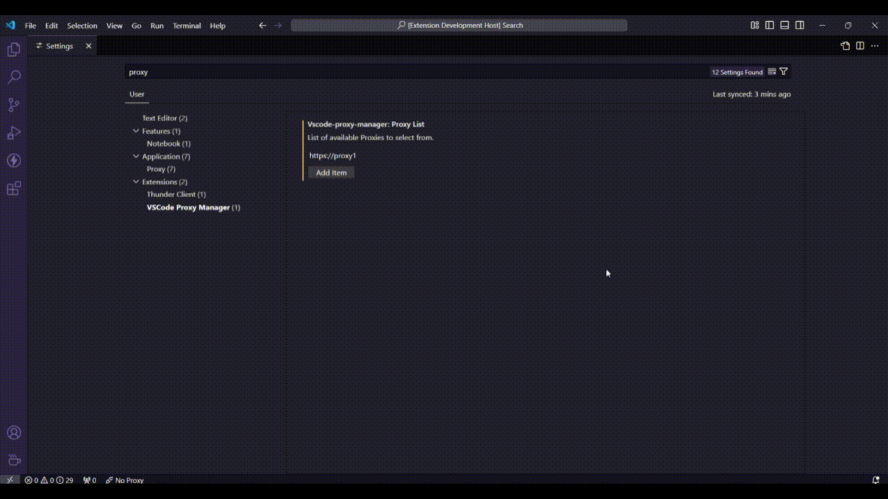

# VSCode Proxy Manager

[](LICENSE)
[](https://code.visualstudio.com/)
[](https://marketplace.visualstudio.com/items?itemName=kanin-020.vscode-proxy-manager)

A lightweight extension to store and switch between multiple proxy configurations in VS Code.

## Features

- Save multiple proxy configurations for quick switching
- Easily enable or disable proxy settings
- Access proxy options from the status bar
- Automatic detection of proxy protocol (HTTP/HTTPS)
- One-click proxy switching via quick pick menu

## Preview



## Installation

### From VS Code Marketplace

1. Open VS Code
2. Go to Extensions (`Ctrl+Shift+X`)
3. Search for "VSCode Proxy Manager"
4. Click **Install**

### From VSIX

1. Download the `.vsix` file from [Releases](https://github.com/Kanin-020/vscode-proxy-manager/releases)
2. Open VS Code
3. Run `Extensions: Install from VSIX...` from the Command Palette
4. Select the downloaded `.vsix` file

## Configuration

Add your proxies in VS Code settings (`settings.json`):

```json
{
    "vscode-proxy-manager.proxyList": [
        "http://proxy-server:8080",
        "https://corporate-proxy:3128",
        "socks5://localhost:1080"
    ]
}
```

### Configuration Options

| Setting                          | Type       | Default | Description                       |
| -------------------------------- | ---------- | ------- | --------------------------------- |
| `vscode-proxy-manager.proxyList` | `string[]` | `[]`    | List of proxy URLs to choose from |

## Usage

1. Look for the proxy icon in the status bar (left side)
2. Click it to open the proxy list
3. Select a proxy or "None" to disable

The status bar shows:

- **$(plug) Proxy** — a proxy is active
- **$(debug-disconnect) No Proxy** — proxy is disabled

## Development

### Prerequisites

- [Node.js](https://nodejs.org/) (v18+)
- [VS Code](https://code.visualstudio.com/)

### Setup

```bash
# Clone the repository
git clone https://github.com/Kanin-020/vscode-proxy-manager.git
cd vscode-proxy-manager

# Install dependencies
npm install

# Compile the extension
npm run compile
```

### Run & Debug

1. Open the project in VS Code
2. Press `F5` to launch the Extension Development Host

### Scripts

| Command           | Description                     |
| ----------------- | ------------------------------- |
| `npm run compile` | Compile the extension           |
| `npm run watch`   | Watch for changes and recompile |
| `npm run package` | Build production bundle         |
| `npm run lint`    | Run ESLint                      |
| `npm test`        | Run tests                       |
| `npm run build`   | Package as `.vsix`              |

## Contributing

Contributions are welcome! Please feel free to submit a [Pull Request](https://github.com/Kanin-020/vscode-proxy-manager/pulls).

1. Fork the repository
2. Create your feature branch (`git checkout -b feature/amazing-feature`)
3. Commit your changes (`git commit -m 'Add amazing feature'`)
4. Push to the branch (`git push origin feature/amazing-feature`)
5. Open a Pull Request

## License

This project is licensed under the Apache License 2.0 — see the [LICENSE](LICENSE) file for details.

## Author

**Jesús Álvarez (Kanin)** — [GitHub](https://github.com/Kanin-020)
